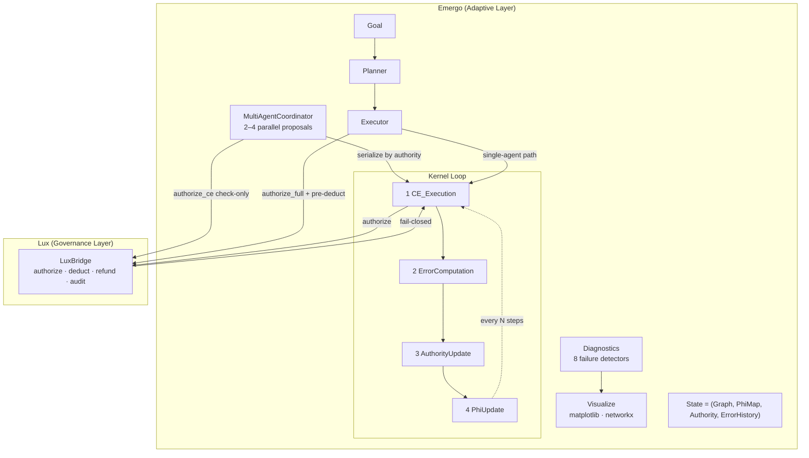

# Emergo: A Self-Organizing Intelligence Engine

[](https://www.python.org/downloads/)
[](LICENSE)
[](tests/)
[](https://github.com/psf/black)

> **A system where agents earn authority by accurately predicting how their
> actions reshape the coordination network — causing intelligence to emerge
> from the structure itself.**

---

## Getting Started

### Install

```bash
pip install emergo                         # core (numpy only)
pip install "emergo[viz]"                  # + matplotlib / networkx plots
pip install "emergo[dev]"                  # + pytest, hypothesis, ruff, mypy
pip install "emergo[dev,viz]"              # everything for development
```

> **From source (editable):**
> ```bash
> git clone https://github.com/markhamcarter220-sketch/Emergo.git
> cd Emergo
> pip install -e ".[dev,viz]"
> emergo demo convergence   # verify installation
> ```

### Quickstart

```python
import numpy as np
from emergo import (
    Graph, emergo_kernel,
    make_initial_phi, make_initial_authority,
    HistoryObserver,
)

# 1. Build a 5-agent ring graph
n = 5
ids = tuple(f"agent_{i}" for i in range(n))
adj = np.zeros((n, n))
for i in range(n):
    adj[i, (i + 1) % n] = 0.5          # directed ring

G0 = Graph(agent_ids=ids, adjacency=adj, capabilities=np.ones((n, 4)) * 0.5)

# 2. Initialize learned state
phi0 = make_initial_phi(d_latent=8, d_features=16, d_ce=4)
A0   = make_initial_authority(ids, baseline=0.5)

# 3. Run the kernel
obs = HistoryObserver()
final_state, reason = emergo_kernel(
    initial_state=(G0, phi0, A0, []),
    max_iterations=500,
    observers=[obs],
)

_, _, A_final, _ = final_state
print(f"Termination:  {reason}")
print(f"CE acceptance: {obs.ce_acceptance_rate:.1%}")
for aid in sorted(A_final.scores):
    print(f"  {aid}: {A_final.get(aid):.3f}")
```

**Expected output:**
```
Termination:  Converged
CE acceptance: 64.3%
  agent_0: 0.621
  agent_1: 0.489
  agent_2: 0.712
  ...
```

### CLI (installed with the package)

```bash
# Run the kernel loop
emergo run                                      # 8 agents, 2000 iterations
emergo run --agents 12 --iterations 5000 --optimizer adam
emergo run --agents 8 --viz --output-dir ./out  # run + save plots
emergo run --collect-diagnostics -o ./diag      # save pickle for later viz

# Visualizations
emergo viz                                      # fresh 5-agent run → plots
emergo viz --input ./diag/emergo_run.pkl        # load saved diagnostics

# Health check (8 failure detectors)
emergo health --agents 10 --iterations 300

# Showcase demos
emergo demo convergence                         # authority + φ loss evolution
emergo demo multi-agent --rounds 6              # Lux-serialized coordination
emergo demo executor                            # DependencyPlanner pipeline
emergo demo stress --agents 20                  # large graph + detector report

# Help
emergo --help
emergo run --help
emergo demo --help
```

Environment variables mirror every flag: `EMERGO_AGENTS`, `EMERGO_ITERATIONS`,
`EMERGO_SEED`, `EMERGO_OUTPUT_DIR`, `EMERGO_OPTIMIZER`.

```bash
EMERGO_AGENTS=16 EMERGO_OPTIMIZER=adam emergo run
```

---

## Architecture



**Lux** = stable governance layer (capabilities, resource ledger, topology enforcement, fail-closed).  
**Emergo** = adaptive execution layer (planning, decomposition, multi-agent coordination, learning).

---

## The Core Idea (Metaphor: A Jazz Ensemble)

**Standard jazz**: The bandleader tells everyone what to play. Clear hierarchy, but rigid.

**Emergo's jazz ensemble**:
- No bandleader.
- Each musician must *predict what the ensemble will sound like* if they play a certain note.
- Musicians who predict well get to initiate more of the band's direction.
- Bad predictions lose influence.
- Over time, musicians who understand how the whole ensemble works become the de-facto leaders — but it's emergent, not assigned.

---

## What It Actually Does (Three Layers)

**Layer 1 — The Interaction**: An agent proposes a **Coordination Event** (CE): a graph mutation (`add_edge`, `remove_edge`, `update_capabilities`) or a task execution (`execute_task`, `decompose_goal`, `delegate`).

**Layer 2 — The Learning Signal**: After execution, the system asks: *Did the topology change the way you predicted?*
- Proposer: judged against its own historical φ-prediction error (global channel)
- Participants: judged against their own structural-delta error history (local channel)
- Each channel's EMA scale is tracked independently (`ErrorScales`) so the two
  incommensurable error magnitudes don't collapse authority by always dominating each other
- Predicted well → authority grows; predicted poorly → authority shrinks
- Authority determines how much future coordination you can initiate

**Layer 3 — The Emergence**: Over thousands of interactions the network self-organizes around agents that predict well. Roles emerge naturally — not assigned.

---

## What Makes It Different

| System | Authority Based On | Result |
|---|---|---|
| Hierarchy | Job title | Brittle, static |
| Democracy | Voting | Noisy, slow |
| Prediction markets | Accuracy on tasks | Specializes but doesn't integrate |
| **Emergo** | **Topology prediction accuracy** | **Self-organizing, adaptive, collective** |

---

## Recipes

### Task execution with Executor

```python
from emergo import Executor, Goal, Graph, Lux, make_initial_phi, make_initial_authority
import numpy as np

G0    = Graph(agent_ids=("planner", "worker"),
              adjacency=np.zeros((2, 2)),
              capabilities=np.ones((2, 2)) * 0.5)
phi0  = make_initial_phi()
A0    = make_initial_authority(G0.agent_ids)
state = (G0, phi0, A0, [])

lux = Lux()
lux.grant_capability("worker", "summarize")

goal = Goal(
    goal_id="g1",
    description="Summarize the quarterly report",
    required_capability="summarize",
    initiating_agent="worker",
    resource_budget=10.0,
)

result = Executor(lux=lux).execute(goal, state)
print(f"Success: {result.success}, resources spent: {result.resources_spent:.2f}")
```

### Custom task runner

```python
from emergo import Executor
from emergo.executor import TaskOutcome

def my_runner(task):
    response = call_my_llm(task.description)  # your tool/API
    return TaskOutcome(
        task_id=task.task_id,
        success=response.ok,
        capability_delta={"dim0": 0.05} if response.ok else {},
        resource_consumed=task.resource_cost,
        notes=response.message,
    )

executor = Executor(lux=lux, task_runner=my_runner)
```

### Dependency-based planning

```python
from emergo import DependencyPlanner, Executor

planner = DependencyPlanner(steps=[
    ("fetch",     "Retrieve source documents",  []),
    ("extract",   "Extract key facts",          ["fetch"]),
    ("summarize", "Write summary draft",        ["extract"]),
    ("validate",  "Validate the draft",         ["summarize", "extract"]),
])
result = Executor(lux=lux, planner=planner).execute(goal, state)
```

`DependencyPlanner` validates the DAG at construction — raises `ValueError` on cycles, unknown dependencies, or duplicate step names.

### Multi-agent coordination

```python
from emergo import MultiAgentCoordinator, ProposedCE, CoordinationEvent

def make_ce(event_type, participants, **params):
    return CoordinationEvent(event_type, participants, frozenset(params.items()))

coord = MultiAgentCoordinator(lux=Lux())
round_ = coord.coordinate([
    ProposedCE("agent_A", make_ce("add_edge", ("A", "B"), weight=0.6)),
    ProposedCE("agent_B", make_ce("add_edge", ("A", "B"), weight=0.3)),  # conflict
    ProposedCE("agent_C", make_ce("add_edge", ("C", "D"), weight=0.5)),
], state)

print(f"Accepted: {[p.agent_id for p in round_.accepted]}")
print(f"Rejected: {round_.rejection_reasons}")
```

### Custom proposal generator

```python
from emergo import WeightedMixGenerator, DefaultProposalGenerator, SequenceProposalGenerator
from emergo.types import CoordinationEvent

# Replay a hand-crafted CE sequence with 20% probability, default 80%
structured = [
    CoordinationEvent("add_edge", ("A", "B"), frozenset([("weight", 0.7)])),
    CoordinationEvent("remove_edge", ("A", "C"), frozenset()),
]
gen = WeightedMixGenerator([
    (DefaultProposalGenerator(), 0.8),
    (SequenceProposalGenerator(structured, loop=True), 0.2),
])

final_state, reason = emergo_kernel(
    initial_state=(G0, phi0, A0, []),
    max_iterations=1000,
    proposal_generator=gen,
)
```

### Observability and health checks

```python
from emergo import run_health_check, emergo_kernel

final_state, reason, diag = emergo_kernel(
    initial_state=(G0, phi0, A0, []),
    max_iterations=500,
    collect_diagnostics=True,
)

results = run_health_check(diag, final_state)
for r in results:
    status = "FAIL" if r.failure_detected else " OK "
    print(f"[{status}] {r.name:<35} severity={r.severity:.2f}")
    print(f"       {r.evidence}")
```

Save plots (requires `pip install "emergo[viz]"`):

```python
from emergo.visualize import render_health_dashboard

saved = render_health_dashboard(diag, final_state, output_dir="./plots")
# → ['./plots/emergo_authority_history.png',
#    './plots/emergo_phi_loss.png',
#    './plots/emergo_edge_count.png']
```

---

## System Invariants

Ten invariants are enforced and tested (`pytest tests/test_invariants.py`):

| Invariant | Description |
|---|---|
| **INV-1** State Ownership | `(G, φ, A, E)` is the only mutable state; all ops are pure functions |
| **INV-2** Feedback Loop | `error → authority → topology` is closed and observable |
| **INV-3** Blast Radius | Failures degrade gracefully; regularization prevents φ collapse |
| **INV-4** Timing | Sequential, atomic, deterministic; no race conditions |
| **INV-5** Proposal-Only Authority | Emergo never mints capabilities; only Lux grants them |
| **INV-6** Resource Conservation | Every task pre-charges Lux ledger; failures trigger refund |
| **INV-7** Observable + Fail-Closed | Every CE attempt (success or failure) is audited |
| **INV-8** Bounded Speculation | Depth limit + per-agent pending CE quota enforced |
| **INV-9** Coordinator Serialization | Parallel proposals sorted by authority; no duplicate edge writes |
| **INV-10** Observer Isolation | Observer exceptions are caught; blast radius is zero |

---

## Configuration

All defaults are overridable via environment variables:

```bash
EMERGO_LUX_MODE=real                    # "simulated" (default) or "real"
EMERGO_MAX_DEPTH=5                      # max task decomposition depth (INV-8)
EMERGO_MAX_PENDING=10                   # max pending CEs per agent (INV-8)
EMERGO_ETA=0.05                         # authority update learning rate
EMERGO_PHI_LR=0.001                     # phi_update learning rate
EMERGO_PHI_OPTIMIZER=adam               # "sgd" (default) or "adam"
EMERGO_PHI_GRAD_CLIP=1.0               # gradient clipping magnitude
EMERGO_PHI_EARLY_STOP=5                 # early-stopping patience (0=off)
EMERGO_RANK_PENALTY=0.1                 # nuclear-norm regularization λ
EMERGO_INITIAL_BUDGET=100.0             # starting resource balance (simulated Lux)
EMERGO_MAX_COORDINATOR_AGENTS=4         # max proposals per coordination round (INV-9)
EMERGO_CONFLICT_STRATEGY=priority       # coordinator conflict resolution strategy
```

---

## Troubleshooting

### `ImportError: No module named 'matplotlib'`

Visualization functions require the optional `viz` extras:

```bash
pip install "emergo[viz]"
```

### Authority scores all collapse to `~0.1`

This failure mode was present before v0.3.0 and is now **fixed by the dual-channel
error normalization** introduced in that release.

**Root cause (historical)**: the old batch-max normalization mixed global
φ-prediction errors (typically small, ~0.001–0.03) with local structural-delta
errors (typically larger, ~0.4–0.7) into a single batch and normalized against
their maximum. As the EMA scale converged to the mean error level, every agent
received `correctness ≈ 0` and `delta ≈ −0.5` on every CE, causing authority to
monotonically decrease until all agents hit the Lux floor.

**Fix (v0.3.0)**: `ErrorScales` tracks independent EMA estimates for each channel
(`global_scale` for proposer errors, `local_scale` for participant errors). The
kernel feeds `2× observed errors` into `ErrorScales.update()` so the scale
converges to twice the mean error — making average performance neutral (delta = 0)
and creating genuine above/below-average differentiation.

If you *do* observe unexpected collapse on a custom graph, check:
1. That the `emergo` package is v0.3.0 or later (`python -c "import emergo; print(emergo.__version__)"`)
2. Run `emergo health --agents 10 --iterations 300` — `detect_authority_collapse` will diagnose it

### `phi_loss` increases instead of decreasing

If rank regularization (λ > 0) is applied to a near-zero φ, the penalty term
can dominate the prediction-loss component during early training. This is
expected when few CEs have been accepted. Try:

```bash
EMERGO_RANK_PENALTY=0.01 emergo-demo    # reduce regularization
```

Or train with more accepted CEs before checking loss (increase `max_iterations`).

### Tests fail with `ImportError` on `_sample_next_ce`

This symbol was removed in a past refactor. The functionality moved to
`DefaultProposalGenerator`. Update imports:

```python
# Old (broken)
from emergo.kernel import _sample_next_ce

# New
from emergo.proposal import DefaultProposalGenerator
gen = DefaultProposalGenerator()
ce = gen.propose(A_t, G_t, rng)
```

### `emergo-demo` command not found after `pip install`

Check that your Python's `bin/` (or `Scripts/` on Windows) is on `PATH`:

```bash
python -m emergo.cli    # always works regardless of PATH
# or
python -c "from emergo.cli import demo; demo()"
```

---

## Core Module Reference

| Module | Responsibility |
|---|---|
| `emergo/types.py` | `Graph`, `CoordinationEvent`, `PhiMap`, `Authority`, `Errors`, `ErrorScales`, `Task`, `Goal` |
| `emergo/kernel.py` | `emergo_kernel` fixed-point loop, `make_initial_phi`, `make_initial_authority` |
| `emergo/ce_execution.py` | Graph-mutation operations; governance guards (remove-agent protection, add-agent cap); INV-1/3/4/12 |
| `emergo/error_computation.py` | Differentiated per-agent errors: global φ-prediction for proposer, local structural delta for participants |
| `emergo/authority_update.py` | `η`-step authority update; dual-channel `ErrorScales` normalization; INV-11 cap |
| `emergo/phi_update.py` | Joint φ/F gradient descent; Adam; rank regularization; early stopping; INV-17 |
| `emergo/features.py` | `extract_graph_features` — fixed-dim spectral + structural features; `lru_cache` on eigvalsh |
| `emergo/lux.py` | `Lux` — single authorization gate |
| `emergo/lux_bridge.py` | `LuxBridge` protocol, `SimulatedLuxBridge`, `RealLuxBridge`, `validate_bridge` |
| `emergo/rate_limiting.py` | `RateLimitedLuxBridge` — per-agent token-bucket rate limiter and blast-radius cap |
| `emergo/executor.py` | Goal decomposition + task execution (INV-5/6/7/8) |
| `emergo/planner.py` | `SequentialPlanner`, `DependencyPlanner` |
| `emergo/coordinator.py` | `MultiAgentCoordinator` (INV-9) |
| `emergo/proposal.py` | `DefaultProposalGenerator`, `SequenceProposalGenerator`, `WeightedMixGenerator` |
| `emergo/observer.py` | `KernelObserver` protocol, `LoggingObserver`, `HistoryObserver` (INV-10) |
| `emergo/metrics.py` | `MetricsObserver` — Prometheus text + OpenTelemetry export |
| `emergo/alerting.py` | `AlertManager` — configurable `AlertRule` instances with per-rule cooldown; 4 built-in rules |
| `emergo/diagnostics.py` | `KernelDiagnostics`, `run_health_check`, 8 failure detectors |
| `emergo/persistence.py` | `save_state` / `load_state` — pickle-based checkpoint |
| `emergo/store.py` | `StateStore` abstraction; `SqliteStore` (WAL), `PickleStore`, `CheckpointKernelObserver` |
| `emergo/distributed.py` | `run_parallel_kernels` — multiprocessing pool; `best_converged`, `all_converged`, `summarize_results` |
| `emergo/sparse.py` | Optional scipy sparse adjacency; `is_sparse_beneficial`, `estimate_memory_bytes` |
| `emergo/logging_config.py` | `JsonFormatter` — single-line ISO-8601 JSON logs; `configure_structured_logging` |
| `emergo/visualize.py` | Optional matplotlib/networkx plots; `print_health_report`; JSON export |
| `emergo/config.py` | All env-var defaults in one place |
| `emergo/cli.py` | `emergo run`, `emergo demo`, `emergo viz`, `emergo health`, `emergo checkpoint` CLI |

---

## What This Is Not

- **Not a marketplace** (no currency, no prices)
- **Not a voting system** (no polls, no majorities)
- **Not a hierarchy** (no org chart)
- **Not a random swarm** (structure emerges, not chaos)

It's closer to how natural systems organize: ant colonies, neural networks, ecosystems.

---

## Roadmap

| Milestone | Status | Description |
|---|---|---|
| Core kernel | ✅ Done | CE execution, error computation, authority update, φ update |
| Lux governance | ✅ Done | Simulated + Real LuxBridge, resource ledger, audit trail |
| Execution runtime | ✅ Done | Executor, SequentialPlanner, DependencyPlanner |
| Multi-agent coordination | ✅ Done | MultiAgentCoordinator, INV-9 serialization |
| Observer protocol | ✅ Done | INV-10 isolation, HistoryObserver, MetricsObserver |
| Proposal generators | ✅ Done | Default (softmax), Sequence, WeightedMix |
| Rank regularization | ✅ Done | Nuclear-norm φ gradient, EMERGO_RANK_PENALTY |
| Dynamic features | ✅ Done | Normalized spectral + structural, any n_agents; lru_cache on eigvalsh |
| Diagnostics | ✅ Done | 8 failure detectors, health report, JSON export |
| Convergence proof | ✅ Done | C1/C2/C3 proof sketch in CONVERGENCE_ANALYSIS.md |
| Safety contract (Tier 1) | ✅ Done | INV-11 through INV-18; Lean 4 theorem stubs; 9 adversarial tests |
| CLI (Typer + Rich) | ✅ Done | `emergo run/demo/viz/health/checkpoint`; env-var config layering |
| Persistence / checkpointing | ✅ Done | `SqliteStore` (WAL), `PickleStore`, `CheckpointKernelObserver`, `emergo checkpoint` |
| Parallel kernel execution | ✅ Done | `run_parallel_kernels` over `multiprocessing.Pool`; `emergo run --workers N` |
| Alerting | ✅ Done | `AlertManager` + 4 built-in rules; per-rule cooldown |
| Structured logging | ✅ Done | `JsonFormatter` ISO-8601 JSON records; `configure_structured_logging` |
| Rate limiting | ✅ Done | `RateLimitedLuxBridge` — per-agent token bucket + blast-radius cap |
| Sparse graph support | ✅ Done | Optional scipy sparse adjacency; `is_sparse_beneficial`, `estimate_memory_bytes` |
| Authority-collapse fix | ✅ Done | Dual-channel `ErrorScales` normalization; 100% CE acceptance on fully-connected graphs |
| Governance guards | ✅ Done | `remove_agent` protects high-authority agents; `add_agent` enforces max-agents cap |
| Windowed φ history | 🔲 Planned | Cap `g_history` length to prevent O(T²) phi_update cost at scale |
| Async kernel | 🔲 Planned | Non-blocking `emergo_kernel_async` for integration with async frameworks |
| Real Lux bindings | 🔲 Planned | Production `RealLuxBridge` for managed Lux infrastructure |
| Package release | ✅ Done | PyPI-ready pyproject.toml, CHANGELOG, v0.3.0 |

---

## Contributing

See [CONTRIBUTING.md](CONTRIBUTING.md) for development setup, code style, how to add
new planners/observers, and invariant testing guidelines.

---

## License

MIT — see [LICENSE](LICENSE).

---

## References

- [SPECIFICATION.md](SPECIFICATION.md) — formal invariants and Lux/Emergo contract
- [CONVERGENCE_ANALYSIS.md](CONVERGENCE_ANALYSIS.md) — C1/C2/C3 proof sketch and auditor checklist
- [CORE_THEOREM_IMPLEMENTATION.md](CORE_THEOREM_IMPLEMENTATION.md) — implementation notes

---

## The Long-Term Vision

**Monolithic AI**: one model does everything — single point of failure.  
**Fragmented AI**: many models, someone stitches them together — brittle.  
**Emergo's vision**: many agents that learn to coordinate intelligently without central direction, where authority flows to whoever understands the system best.
