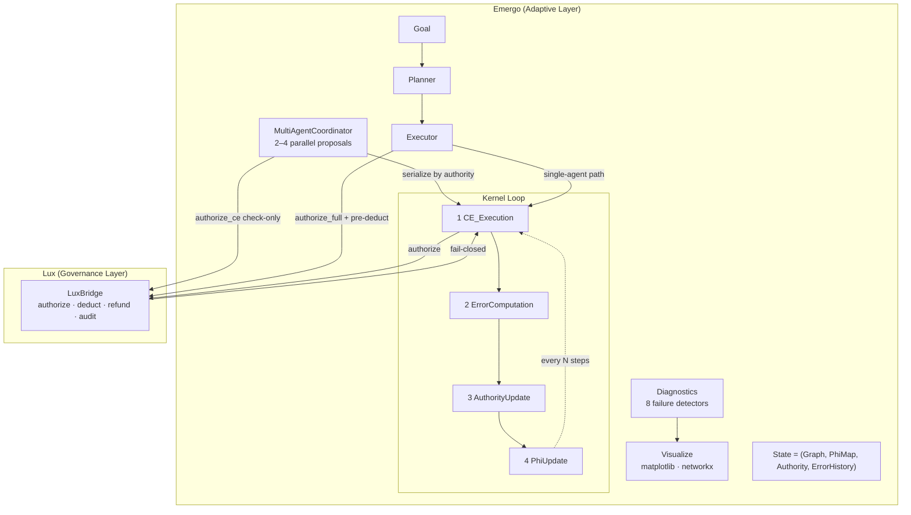

# Emergo: A Self-Organizing Intelligence Engine

## One-Sentence Summary
A system where agents earn authority by accurately predicting how their actions reshape the coordination network, causing intelligence to emerge from the structure itself.

---

## Architecture



**Lux** = stable governance layer (capabilities, resource ledger, topology enforcement, fail-closed).  
**Emergo** = adaptive execution layer (planning, decomposition, multi-agent coordination, learning).

Emergo never grants capabilities, never modifies ledger balances directly, and never
bypasses Lux. Every coordination event crosses the `LuxBridge`.

---

## The Core Idea (Metaphor: A Jazz Ensemble)

**Standard jazz**: The bandleader tells everyone what to play. Clear hierarchy, but rigid.

**Emergo's jazz ensemble**:
- No bandleader
- Each musician has to predict what the *ensemble will sound like* if they play a certain note
- Musicians who predict well get to initiate more of the band's direction
- Bad predictions lose influence
- Over time, the musicians that understand how the whole ensemble works together become the de-facto leaders
- But it's not a hierarchy — it's emergent structure

That's Emergo.

---

## What It Actually Does (Three Layers)

### Layer 1: The Interaction
An agent proposes a **Coordination Event** (CE): a graph mutation or a task execution.

### Layer 2: The Learning Signal
After execution, the system asks: *Did the topology change the way you predicted?*

- If you predicted well → your authority grows
- If you predicted poorly → your authority shrinks
- Authority determines how much future coordination you can initiate

### Layer 3: The Emergence
Over thousands of interactions, the network self-organizes around agents that predict well.
Roles (planner, verifier, connector) emerge naturally — not assigned.

---

## What Makes It Different

| System | Authority Based On | Result |
|---|---|---|
| Hierarchy | Job title | Brittle, static |
| Democracy | Voting | Noisy, slow |
| Prediction markets | Accuracy on tasks | Specializes but doesn't integrate |
| **Emergo** | **Topology prediction accuracy** | **Self-organizing, adaptive, collective** |

---

## Getting Started

### Installation

```bash
pip install -r requirements.txt
```

### Minimal Example (structural loop)

```python
from emergo import Graph, Lux, emergo_kernel, make_initial_phi, make_initial_authority
import numpy as np

adj = np.array([[0, 1, 0], [0, 0, 1], [1, 0, 0]], dtype=float)
caps = np.ones((3, 2)) * 0.5
G0 = Graph(agent_ids=("A", "B", "C"), adjacency=adj, capabilities=caps)

phi0 = make_initial_phi(d_latent=8, d_features=16, d_ce=4)
A0 = make_initial_authority(G0.agent_ids)

final_state, reason = emergo_kernel(
    initial_state=(G0, phi0, A0, []),
    max_iterations=1000,
    convergence_threshold=1e-4,
)
print(reason)  # "Converged" or "Max iterations reached"
```

### Task Execution (Executor path)

```python
from emergo import (
    Executor, Goal, Graph, Lux,
    make_initial_phi, make_initial_authority,
)
import numpy as np

# Build graph and initial state
adj = np.zeros((2, 2))
caps = np.ones((2, 2)) * 0.5
G0 = Graph(agent_ids=("planner", "worker"), adjacency=adj, capabilities=caps)
phi0 = make_initial_phi(d_latent=8, d_features=16, d_ce=4)
A0 = make_initial_authority(G0.agent_ids)
state = (G0, phi0, A0, [])

# Grant capabilities via Lux (not via Emergo)
lux = Lux()
lux.grant_capability("planner", "orchestrate")
lux.grant_capability("worker", "summarize")

# Execute a goal
goal = Goal(
    goal_id="g1",
    description="Summarize the quarterly report",
    required_capability="summarize",
    initiating_agent="worker",
    resource_budget=10.0,
)

executor = Executor(lux=lux)
result = executor.execute(goal, state)

print(f"Success: {result.success}")
print(f"Tasks completed: {result.tasks_succeeded}/{result.tasks_attempted}")
print(f"Resources spent: {result.resources_spent:.2f}")
print(f"Audit trail: {result.audit_ids}")
```

### Custom Task Runner

```python
from emergo.executor import TaskOutcome

def my_runner(task):
    # Call your actual tool, API, or sub-agent here
    result = call_my_tool(task.description)
    return TaskOutcome(
        task_id=task.task_id,
        success=result.ok,
        capability_delta={"dim0": 0.05} if result.ok else {},
        resource_consumed=task.resource_cost,
        notes=result.message,
    )

executor = Executor(lux=lux, task_runner=my_runner)
```

### Multi-step Goals with SequentialPlanner

```python
from emergo import SequentialPlanner

planner = SequentialPlanner(steps=[
    "Retrieve relevant documents",
    "Extract key facts",
    "Generate summary",
])
executor = Executor(lux=lux, planner=planner)
result = executor.execute(goal, state)
```

---

## Multi-Agent Coordination

`MultiAgentCoordinator` lets 2–4 agents submit proposals simultaneously.
Proposals are **serialized by authority** (INV-9) before Lux evaluates them:

```python
from emergo import MultiAgentCoordinator, ProposedCE

lux = Lux()
coord = MultiAgentCoordinator(lux=lux)

round_ = coord.coordinate([
    ProposedCE("agent_A", make_ce("add_edge", ("A", "B"), weight=0.6)),
    ProposedCE("agent_B", make_ce("add_edge", ("A", "B"), weight=0.3)),
    ProposedCE("agent_C", make_ce("add_edge", ("C", "D"), weight=0.5)),
], state)

print(f"Accepted: {[p.agent_id for p in round_.accepted]}")
print(f"Rejected: {round_.rejection_reasons}")
final_state = round_.final_state
```

**What the coordinator guarantees:**
- At most 4 proposals per round (configurable via `EMERGO_MAX_COORDINATOR_AGENTS`)
- Proposals with the same directed edge are conflicts — only the highest-authority one proceeds
- Every proposal generates an audit record, accepted or not
- No resource is charged for conflict-rejected proposals

---

## Observability & Visualization

Run the kernel with diagnostics enabled to get a health report:

```python
final_state, reason, diag = emergo_kernel(
    initial_state=(G0, phi0, A0, []),
    max_iterations=500,
    collect_diagnostics=True,
)

from emergo import run_health_check
results = run_health_check(diag, final_state)
for r in results:
    status = "FAIL" if r.failure_detected else " OK "
    print(f"[{status}] {r.name:<35} severity={r.severity:.2f}")
    print(f"       {r.evidence}")
```

Save visualizations (requires `pip install matplotlib networkx`):

```python
from emergo.visualize import render_health_dashboard

saved = render_health_dashboard(diag, final_state, output_dir="./plots")
print(f"Saved: {saved}")
# → ['./plots/emergo_authority_history.png',
#    './plots/emergo_phi_loss.png',
#    './plots/emergo_edge_count.png']
```

---

## Observers (INV-10)

Attach read-only observers to the kernel to accumulate metrics without interfering:

```python
from emergo import HistoryObserver, LoggingObserver, emergo_kernel

obs = HistoryObserver()
final_state, reason = emergo_kernel(
    initial_state, max_iterations=200, observers=[obs]
)
print(f"Acceptance rate: {obs.ce_acceptance_rate:.0%}")
print(f"Final mean error: {obs.mean_errors[-1]:.4f}")
print(obs.summary())
```

Observer exceptions are caught and logged — they can never crash the kernel (INV-10).

---

## Dependency-Based Planning

Use `DependencyPlanner` when task steps have explicit prerequisites:

```python
from emergo import DependencyPlanner, Executor

planner = DependencyPlanner(steps=[
    ("fetch",     "Retrieve source documents",  []),
    ("extract",   "Extract key facts",          ["fetch"]),
    ("summarize", "Write summary draft",        ["extract"]),
    ("validate",  "Validate the draft",         ["summarize", "extract"]),
])
executor = Executor(lux=lux, planner=planner)
result = executor.execute(goal, state)
```

`DependencyPlanner` validates the DAG at construction: raises `ValueError` on cycles,
unknown dependencies, or duplicate step names.

---

## System Invariants

Ten invariants are enforced and tested:

| Invariant | Description |
|---|---|
| **INV-1** State Ownership | `(G, φ, A, E)` is the only mutable state; all ops are pure functions |
| **INV-2** Feedback Loop | `error → authority → topology` is closed and observable |
| **INV-3** Blast Radius | Failures degrade gracefully; φ reverts on entanglement violation |
| **INV-4** Timing | Sequential, atomic, deterministic; no race conditions |
| **INV-5** Proposal-Only Authority | Emergo never mints capabilities; only Lux grants them |
| **INV-6** Resource Conservation | Every task pre-charges Lux ledger; failures trigger refund |
| **INV-7** Observable + Fail-Closed | Every CE attempt (success or failure) is audited |
| **INV-8** Bounded Speculation | Depth limit + per-agent pending CE quota enforced |
| **INV-9** Coordinator Serialization | Parallel proposals sorted by authority; no duplicate edge writes |
| **INV-10** Observer Isolation | Observer exceptions are caught and logged; blast radius zero |

Run the invariant tests:

```bash
python -m pytest tests/test_invariants.py -v
```

---

## Configuration

Override any default via environment variable:

```bash
EMERGO_LUX_MODE=real                    # "simulated" (default) or "real"
EMERGO_MAX_DEPTH=5                      # max task decomposition depth
EMERGO_MAX_PENDING=10                   # max pending CEs per agent
EMERGO_ETA=0.05                         # authority update learning rate
EMERGO_INITIAL_BUDGET=100.0             # starting resource balance (simulated Lux)
EMERGO_MAX_COORDINATOR_AGENTS=4         # max proposals per coordination round (INV-9)
EMERGO_CONFLICT_STRATEGY=priority       # coordinator conflict resolution
```

---

## Core References

- **SPECIFICATION.md** — formal invariants, state machine, and Lux/Emergo contract
- **emergo/lux_bridge.py** — `LuxBridge` protocol + `SimulatedLuxBridge` + `RealLuxBridge` + `validate_bridge()`
- **emergo/lux.py** — single authorization gate
- **emergo/executor.py** — Goal execution loop (INV-5/6/7/8)
- **emergo/coordinator.py** — MultiAgentCoordinator (INV-9)
- **emergo/observer.py** — `KernelObserver` protocol + `LoggingObserver` + `HistoryObserver` (INV-10)
- **emergo/planner.py** — `Planner`, `SequentialPlanner`, `DependencyPlanner`
- **emergo/ce_execution.py** — graph-mutation operations (INV-1/3/4)
- **emergo/phi_update.py** — joint φ/F gradient descent (entanglement guard)
- **emergo/diagnostics.py** — 8 failure-mode detectors + health report
- **emergo/visualize.py** — optional matplotlib/networkx plots + `print_health_report()` + `export_diagnostics_json()`
- **tests/test_invariants.py** — all ten invariants verified in code
- **tests/test_coordinator.py** — MultiAgentCoordinator test suite
- **tests/test_observer.py** — observer protocol and INV-10 isolation tests
- **tests/test_planner.py** — Planner / SequentialPlanner / DependencyPlanner tests
- **tests/test_integration.py** — end-to-end pipeline tests

---

## What This Is Not

- **Not a marketplace** (no currency, no prices)
- **Not a voting system** (no polls, no majorities)
- **Not a hierarchy** (no org chart)
- **Not a random swarm** (structure emerges, not chaos)

It's closer to how natural systems organize: ant colonies, neural networks, ecosystems.

---

## The Long-Term Vision

**Monolithic AI**: one model does everything — single point of failure.  
**Fragmented AI**: many models, someone stitches them together — brittle.  
**Emergo's vision**: many agents that learn to coordinate intelligently without central direction, where authority flows to whoever understands the system best.
